# Class Diagram - Expense Sharing System

## Mermaid Class Diagram

```mermaid
classDiagram
    %% Entity Layer
    class User {
        -String id
        -String name
        -String email
        -String phone
        +getId() String
        +getName() String
        +getEmail() String
        +getPhone() String
        +equals(Object) boolean
        +hashCode() int
    }

    class Expense {
        -String id
        -String description
        -Double totalAmount
        -User paidBy
        -List~Split~ splits
        -SplitType splitType
        -Group group
        -LocalDateTime timestamp
        +getId() String
        +getDescription() String
        +getTotalAmount() Double
        +getPaidBy() User
        +getSplits() List~Split~
        +getSplitType() SplitType
        +getGroup() Group
        +getTimestamp() LocalDateTime
        +isValid() boolean
        +involves(User) boolean
    }

    class Split {
        -User user
        -Double amount
        -Double percentage
        +Split(User, Double)
        +Split(User, Double, Double)
        +getUser() User
        +getAmount() Double
        +setAmount(Double) void
        +getPercentage() Double
    }

    class Group {
        -String id
        -String name
        -List~User~ members
        -List~Expense~ expenses
        -LocalDateTime createdAt
        +getId() String
        +getName() String
        +getMembers() List~User~
        +getExpenses() List~Expense~
        +getCreatedAt() LocalDateTime
        +addMember(User) void
        +removeMember(User) void
        +addExpense(Expense) void
        +isMember(User) boolean
    }

    class Balance {
        -User fromUser
        -User toUser
        -Double amount
        +getFromUser() User
        +getToUser() User
        +getAmount() Double
        +setAmount(Double) void
    }

    class SplitType {
        <<enumeration>>
        EQUAL
        EXACT
        PERCENTAGE
    }

    %% Strategy Pattern Layer
    class ExpenseSplitStrategy {
        <<interface>>
        +calculateSplits(Expense, List~User~, Map~String,Object~) List~Split~
        +validate(Expense, List~User~, Map~String,Object~) boolean
    }

    class EqualSplitStrategy {
        +calculateSplits(Expense, List~User~, Map~String,Object~) List~Split~
        +validate(Expense, List~User~, Map~String,Object~) boolean
    }

    class ExactSplitStrategy {
        +calculateSplits(Expense, List~User~, Map~String,Object~) List~Split~
        +validate(Expense, List~User~, Map~String,Object~) boolean
    }

    class PercentageSplitStrategy {
        +calculateSplits(Expense, List~User~, Map~String,Object~) List~Split~
        +validate(Expense, List~User~, Map~String,Object~) boolean
    }

    %% Service Layer
    class ExpenseService {
        -List~Expense~ expenses
        -BalanceManager balanceManager
        -Map~SplitType,ExpenseSplitStrategy~ strategyMap
        -int expenseIdCounter
        +createExpense(String, Double, User, List~User~, SplitType, Map~String,Object~, Group) Expense
        +createEqualExpense(String, Double, User, List~User~, Group) Expense
        +createExactExpense(String, Double, User, Map~User,Double~, Group) Expense
        +createPercentageExpense(String, Double, User, Map~User,Double~, Group) Expense
        +getExpenseById(String) Expense
        +getExpensesByUser(User) List~Expense~
        +getExpensesByGroup(Group) List~Expense~
        +getAllExpenses() List~Expense~
        -registerStrategy(SplitType, ExpenseSplitStrategy) void
        -generateExpenseId() String
    }

    class BalanceManager {
        -Map~String,Map~String,Double~~ balances
        +updateBalances(Expense) void
        +getUserBalances(User) Map~User,Double~
        +getAllBalances() List~Balance~
        +getBalance(User, User) Double
        +recordPayment(User, User, Double) void
        +simplifyDebts() List~Balance~
        +printAllBalances() void
        -updateBalance(User, User, Double) void
        -getBalanceKey(User, User) String
    }

    class GroupService {
        -List~Group~ groups
        -ExpenseService expenseService
        -int groupIdCounter
        +createGroup(String, List~User~) Group
        +getGroupById(String) Group
        +getAllGroups() List~Group~
        +addMemberToGroup(String, User) void
        +removeMemberFromGroup(String, User) void
        +getGroupBalances(String) List~Balance~
        +printGroupSummary(String) void
        -generateGroupId() String
    }

    class UserService {
        -Map~String,User~ users
        -Map~String,User~ emailIndex
        -int userIdCounter
        +createUser(String, String, String) User
        +getUserById(String) User
        +getUserByEmail(String) User
        +getAllUsers() List~User~
        -generateUserId() String
    }

    %% Relationships - Entity Layer
    Expense "1" *-- "many" Split : contains
    Split "many" --> "1" User : references
    Expense "many" --> "1" User : paidBy
    Expense "many" --> "1" SplitType : uses
    Group "1" *-- "many" User : contains
    Group "1" *-- "many" Expense : contains
    Balance "1" --> "1" User : fromUser
    Balance "1" --> "1" User : toUser

    %% Relationships - Strategy Pattern
    ExpenseSplitStrategy <|.. EqualSplitStrategy : implements
    ExpenseSplitStrategy <|.. ExactSplitStrategy : implements
    ExpenseSplitStrategy <|.. PercentageSplitStrategy : implements

    %% Relationships - Service Layer
    ExpenseService --> BalanceManager : depends on
    ExpenseService --> ExpenseSplitStrategy : uses
    ExpenseService ..> Expense : creates
    ExpenseService ..> Split : creates
    GroupService --> ExpenseService : depends on
    GroupService ..> Group : creates
    UserService ..> User : creates
    BalanceManager ..> Balance : creates

    %% Notes
    note for ExpenseSplitStrategy "Strategy Pattern: Allows different\nsplit calculation algorithms"
    note for ExpenseService "Uses Strategy Pattern to delegate\nsplit calculations. Follows OCP."
    note for BalanceManager "Tracks debts between users.\nCan simplify complex debt chains."
```



## Visual Representation

```
┌─────────────────────────────────────────────────────────────────────────────────┐
│                           EXPENSE SHARING SYSTEM                                 │
│                              Class Diagram                                       │
└─────────────────────────────────────────────────────────────────────────────────┘

┌──────────────────────────────────────────────────────────────────────────────────┐
│                              ENTITY LAYER                                         │
└──────────────────────────────────────────────────────────────────────────────────┘

┌─────────────────────┐
│      User           │
├─────────────────────┤
│ - id: String        │
│ - name: String      │
│ - email: String     │
│ - phone: String     │
├─────────────────────┤
│ + getId()           │
│ + getName()         │
│ + getEmail()        │
│ + getPhone()        │
└─────────────────────┘
         △
         │
         │ references
         │
         ▼
┌─────────────────────┐         ┌──────────────────────────┐
│      Split          │◆────────│       Expense            │
├─────────────────────┤         ├──────────────────────────┤
│ - user: User        │         │ - id: String             │
│ - amount: Double    │         │ - description: String    │
│ - percentage: Double│         │ - totalAmount: Double    │
├─────────────────────┤         │ - paidBy: User           │
│ + getUser()         │         │ - splits: List<Split>    │
│ + getAmount()       │         │ - splitType: SplitType   │
│ + getPercentage()   │         │ - group: Group           │
└─────────────────────┘         │ - timestamp: LocalDateTime│
                                ├──────────────────────────┤
                                │ + getId()                │
                                │ + getDescription()       │
                                │ + getTotalAmount()       │
                                │ + getPaidBy()            │
                                │ + getSplits()            │
                                │ + getSplitType()         │
                                │ + getGroup()             │
                                │ + getTimestamp()         │
                                └──────────────────────────┘
                                         △
                                         │
                                         │ contains
                                         │
                                         ▼
┌─────────────────────┐         ┌──────────────────────────┐
│      Balance        │         │        Group             │
├─────────────────────┤         ├──────────────────────────┤
│ - fromUser: User    │         │ - id: String             │
│ - toUser: User      │         │ - name: String           │
│ - amount: Double    │         │ - members: List<User>    │
├─────────────────────┤         │ - expenses: List<Expense>│
│ + getFromUser()     │         ├──────────────────────────┤
│ + getToUser()       │         │ + getId()                │
│ + getAmount()       │         │ + getName()              │
│ + setAmount()       │         │ + getMembers()           │
└─────────────────────┘         │ + getExpenses()          │
                                │ + addMember()            │
                                │ + removeMember()         │
                                │ + addExpense()           │
                                └──────────────────────────┘

┌─────────────────────┐
│   <<enumeration>>   │
│     SplitType       │
├─────────────────────┤
│ EQUAL               │
│ EXACT               │
│ PERCENTAGE          │
└─────────────────────┘


┌──────────────────────────────────────────────────────────────────────────────────┐
│                           STRATEGY PATTERN LAYER                                  │
└──────────────────────────────────────────────────────────────────────────────────┘

                    ┌────────────────────────────────────────┐
                    │    <<interface>>                       │
                    │    ExpenseSplitStrategy                │
                    ├────────────────────────────────────────┤
                    │ + calculateSplits(                     │
                    │     expense: Expense,                  │
                    │     participants: List<User>,          │
                    │     metadata: Map<String, Object>      │
                    │   ): List<Split>                       │
                    │ + validate(                            │
                    │     expense: Expense,                  │
                    │     participants: List<User>,          │
                    │     metadata: Map<String, Object>      │
                    │   ): boolean                           │
                    └────────────────────────────────────────┘
                                    △
                                    │ implements
                    ┌───────────────┼───────────────┐
                    │               │               │
                    │               │               │
        ┌───────────▼──────────┐   │   ┌───────────▼──────────┐
        │ EqualSplitStrategy   │   │   │ ExactSplitStrategy   │
        ├──────────────────────┤   │   ├──────────────────────┤
        │ + calculateSplits()  │   │   │ + calculateSplits()  │
        │ + validate()         │   │   │ + validate()         │
        └──────────────────────┘   │   └──────────────────────┘
                                   │
                       ┌───────────▼──────────────┐
                       │ PercentageSplitStrategy  │
                       ├──────────────────────────┤
                       │ + calculateSplits()      │
                       │ + validate()             │
                       └──────────────────────────┘


┌──────────────────────────────────────────────────────────────────────────────────┐
│                              SERVICE LAYER                                        │
└──────────────────────────────────────────────────────────────────────────────────┘

┌─────────────────────────────────────────────────────────────────────┐
│                        ExpenseService                                │
├─────────────────────────────────────────────────────────────────────┤
│ - expenses: List<Expense>                                            │
│ - balanceManager: BalanceManager                                     │
│ - strategyMap: Map<SplitType, ExpenseSplitStrategy>                 │
├─────────────────────────────────────────────────────────────────────┤
│ + createExpense(description, amount, paidBy, participants,          │
│                 splitType, group): Expense                           │
│ + createExpenseWithExactAmounts(description, amount, paidBy,        │
│                                  exactAmounts, group): Expense       │
│ + createExpenseWithPercentages(description, amount, paidBy,         │
│                                 percentages, group): Expense         │
│ + getExpenseById(id): Expense                                        │
│ + getExpensesByUser(user): List<Expense>                             │
│ + getExpensesByGroup(group): List<Expense>                           │
│ - registerStrategy(splitType, strategy): void                        │
└─────────────────────────────────────────────────────────────────────┘
                    │
                    │ depends on
                    ▼
┌─────────────────────────────────────────────────────────────────────┐
│                        BalanceManager                                │
├─────────────────────────────────────────────────────────────────────┤
│ - balances: Map<String, Map<String, Double>>                        │
├─────────────────────────────────────────────────────────────────────┤
│ + updateBalances(expense: Expense): void                             │
│ + getUserBalances(user: User): Map<User, Double>                     │
│ + getAllBalances(): List<Balance>                                    │
│ + getBalance(user1: User, user2: User): Double                       │
│ + recordPayment(fromUser: User, toUser: User, amount: Double): void │
│ + simplifyDebts(): List<Balance>                                     │
│ - getBalanceKey(user1: User, user2: User): String                    │
└─────────────────────────────────────────────────────────────────────┘


┌─────────────────────────────────────────────────────────────────────┐
│                        GroupService                                  │
├─────────────────────────────────────────────────────────────────────┤
│ - groups: List<Group>                                                │
│ - expenseService: ExpenseService                                     │
├─────────────────────────────────────────────────────────────────────┤
│ + createGroup(name: String, members: List<User>): Group              │
│ + getGroupById(id: String): Group                                    │
│ + addMemberToGroup(groupId: String, user: User): void                │
│ + removeMemberFromGroup(groupId: String, user: User): void           │
│ + addExpenseToGroup(groupId: String, expense: Expense): void         │
│ + getGroupBalances(groupId: String): List<Balance>                   │
└─────────────────────────────────────────────────────────────────────┘


┌─────────────────────────────────────────────────────────────────────┐
│                        UserService                                   │
├─────────────────────────────────────────────────────────────────────┤
│ - users: Map<String, User>                                           │
├─────────────────────────────────────────────────────────────────────┤
│ + createUser(name: String, email: String, phone: String): User      │
│ + getUserById(id: String): User                                      │
│ + getUserByEmail(email: String): User                                │
│ + getAllUsers(): List<User>                                          │
└─────────────────────────────────────────────────────────────────────┘


┌──────────────────────────────────────────────────────────────────────────────────┐
│                         RELATIONSHIPS SUMMARY                                     │
└──────────────────────────────────────────────────────────────────────────────────┘

ASSOCIATIONS:
  User ←────→ Group (many-to-many)
  User ←────→ Expense (one-to-many via paidBy)
  Expense ──→ Split (one-to-many, composition)
  Split ────→ User (many-to-one)
  Group ────→ Expense (one-to-many, composition)
  Balance ──→ User (two many-to-one: fromUser, toUser)

DEPENDENCIES:
  ExpenseService ──→ ExpenseSplitStrategy (interface)
  ExpenseService ──→ BalanceManager
  GroupService ──→ ExpenseService
  EqualSplitStrategy ──→ ExpenseSplitStrategy (implements)
  ExactSplitStrategy ──→ ExpenseSplitStrategy (implements)
  PercentageSplitStrategy ──→ ExpenseSplitStrategy (implements)

COMPOSITION:
  Expense ◆──→ Split (Expense owns Splits)
  Group ◆──→ User (Group contains Users)
  Group ◆──→ Expense (Group contains Expenses)


┌──────────────────────────────────────────────────────────────────────────────────┐
│                         DESIGN PATTERNS APPLIED                                   │
└──────────────────────────────────────────────────────────────────────────────────┘

1. STRATEGY PATTERN
   ├─ Interface: ExpenseSplitStrategy
   ├─ Concrete Strategies: EqualSplitStrategy, ExactSplitStrategy, PercentageSplitStrategy
   ├─ Context: ExpenseService
   └─ Benefit: Easy to add new split algorithms without modifying existing code

2. SERVICE LAYER PATTERN
   ├─ Services: ExpenseService, GroupService, UserService, BalanceManager
   └─ Benefit: Separation of business logic from domain entities

3. DEPENDENCY INJECTION
   ├─ ExpenseService receives BalanceManager
   ├─ GroupService receives ExpenseService
   └─ Benefit: Loose coupling, easier testing

4. COMPOSITION OVER INHERITANCE
   ├─ Expense uses ExpenseSplitStrategy (composition)
   ├─ Group contains Users and Expenses (composition)
   └─ Benefit: More flexible than inheritance hierarchies


┌──────────────────────────────────────────────────────────────────────────────────┐
│                         SOLID PRINCIPLES MAPPING                                  │
└──────────────────────────────────────────────────────────────────────────────────┘

S - Single Responsibility Principle
    ├─ User: Only manages user data
    ├─ Expense: Only manages expense data
    ├─ ExpenseSplitStrategy: Only handles split calculation
    ├─ BalanceManager: Only handles balance tracking
    └─ Each service has one clear responsibility

O - Open/Closed Principle
    ├─ ExpenseSplitStrategy: Open for extension (new strategies)
    ├─ Closed for modification (existing code unchanged)
    └─ Can add new split types without changing ExpenseService

L - Liskov Substitution Principle
    └─ All ExpenseSplitStrategy implementations are interchangeable

I - Interface Segregation Principle
    ├─ ExpenseSplitStrategy: Small, focused interface
    └─ No client forced to depend on unused methods

D - Dependency Inversion Principle
    ├─ ExpenseService depends on ExpenseSplitStrategy (abstraction)
    ├─ Not on concrete strategy implementations
    └─ High-level modules depend on abstractions


┌──────────────────────────────────────────────────────────────────────────────────┐
│                         EXTENSIBILITY POINTS                                      │
└──────────────────────────────────────────────────────────────────────────────────┘

1. New Split Strategies
   └─ Implement ExpenseSplitStrategy interface
   └─ Examples: ShareBasedSplit, RatioSplit, WeightedSplit

2. Notification System
   └─ Add NotificationService interface
   └─ Implementations: EmailNotification, SMSNotification, PushNotification

3. Persistence Layer
   └─ Add Repository interfaces
   └─ Implementations: InMemoryRepository, DatabaseRepository, FileRepository

4. Currency Support
   └─ Add Currency class
   └─ Add CurrencyConverter service

5. Expense Categories
   └─ Add Category enum
   └─ Add to Expense entity

6. Payment Methods
   └─ Add PaymentMethod enum
   └─ Track how expenses were paid
```

## UML Notation Legend

```
┌─────────────────────┐
│   Class Name        │  ← Class box
├─────────────────────┤
│ - privateField      │  ← Attributes (- private, + public, # protected)
│ + publicField       │
├─────────────────────┤
│ + publicMethod()    │  ← Methods
│ - privateMethod()   │
└─────────────────────┘

△  = Inheritance/Implementation
│  = Association
──→ = Dependency
◆──→ = Composition (strong ownership)
◇──→ = Aggregation (weak ownership)
```

## How to Read This Diagram

1. **Top to Bottom**: Entity Layer → Strategy Layer → Service Layer
2. **Left to Right**: Core entities → Supporting entities
3. **Arrows**: Show relationships and dependencies
4. **Patterns**: Clearly marked with their implementations

## Key Takeaways

- **Modular Design**: Clear separation between entities, strategies, and services
- **Extensible**: Easy to add new features without breaking existing code
- **Testable**: Each component can be tested independently
- **Maintainable**: Clear responsibilities and relationships
- **Scalable**: Can handle growth in users, groups, and expenses
