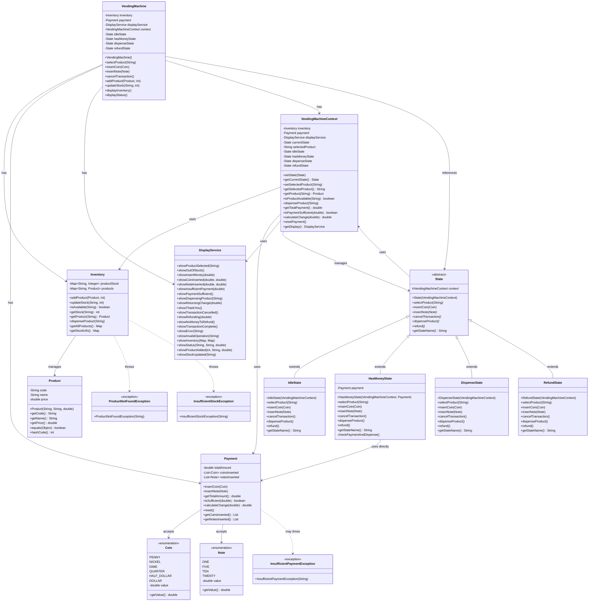
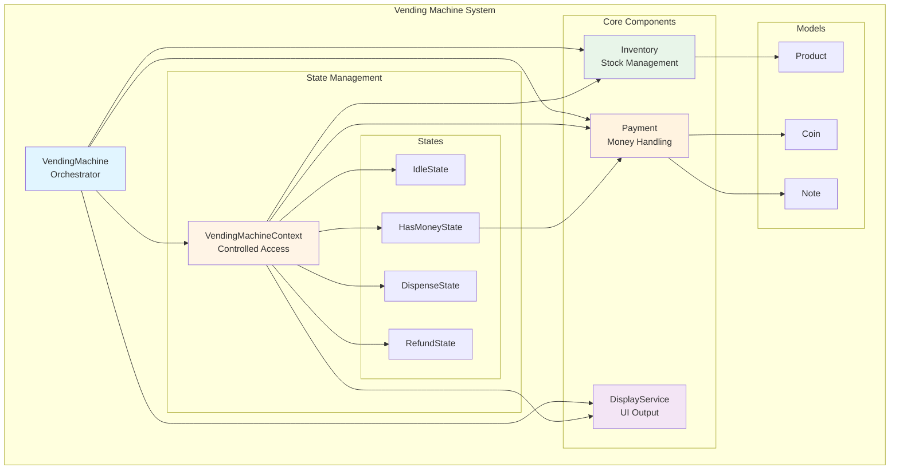

# Vending Machine Class Diagram

## UML Class Diagram



## Simplified Component Diagram



## Design Patterns Used

### 1. **State Pattern** 🔄
- **Context**: `VendingMachineContext`
- **Abstract State**: `State`
- **Concrete States**: `IdleState`, `HasMoneyState`, `DispenseState`, `RefundState`

### 2. **Facade Pattern** 🎭
- **Facade**: `VendingMachine`
- Provides simplified interface to complex subsystem

### 3. **Strategy Pattern** 💡
- Different states encapsulate different behaviors
- Runtime state switching changes behavior

## Key Relationships

| Relationship | Type | Description |
|-------------|------|-------------|
| VendingMachine → Components | **Composition** | Owns Inventory, Payment, DisplayService |
| VendingMachine → Context | **Composition** | Creates and manages context |
| State → VendingMachineContext | **Association** | Uses context for operations |
| ConcreteState → State | **Inheritance** | Extends abstract state |
| Inventory → Product | **Aggregation** | Manages collection of products |
| Payment → Coin/Note | **Association** | Accepts and tracks money |

## Dependency Flow

```
User Input
    ↓
VendingMachine (Facade)
    ↓
VendingMachineContext
    ↓
Current State (polymorphism)
    ↓
├─→ Inventory (stock operations)
├─→ Payment (money operations)
└─→ DisplayService (output)
```

## SOLID Principles Illustrated

- **SRP**: Each class has one responsibility
  - `DisplayService` → UI only
  - `Inventory` → Stock only
  - `Payment` → Money only
  
- **OCP**: Open for extension
  - New states can be added
  - DisplayService can be swapped
  
- **LSP**: States are substitutable
  - All states implement State interface
  
- **ISP**: Focused interfaces
  - Context provides specific methods
  
- **DIP**: Depend on abstractions
  - States depend on Context, not VendingMachine
