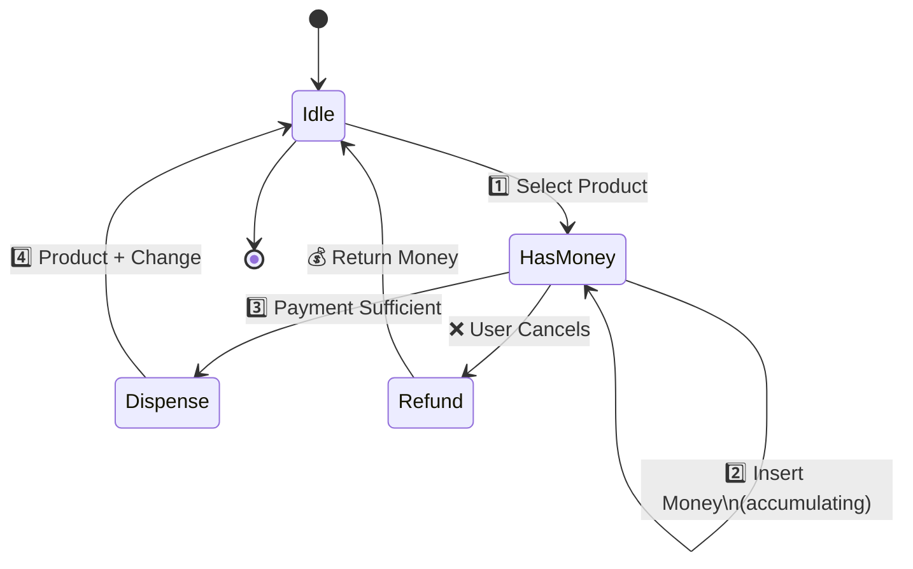

# Vending Machine State Diagram

## Simple State Diagram



## 4 States Explained

### 1️⃣ **IdleState** 
Waiting for customer
- User selects a product → Move to HasMoneyState

### 2️⃣ **HasMoneyState**
Collecting payment
- User inserts coins/notes → Stay in HasMoneyState (accumulating money)
- Payment sufficient → Move to DispenseState
- User cancels → Move to RefundState

### 3️⃣ **DispenseState**
Giving product and change
- Dispense product + return change → Move to IdleState

### 4️⃣ **RefundState**
Returning money
- Return all money → Move to IdleState

---

## Example Flows

### ✅ Successful Purchase
```
Idle → Select "Coke" → HasMoney → Insert $2 → Dispense → Idle
```

### ❌ Cancelled Purchase
```
Idle → Select "Coke" → HasMoney → Insert $1 → Cancel → Refund → Idle
```
